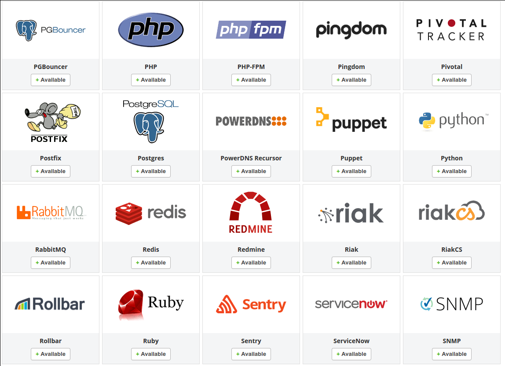

# DataDog

Es Ruby-Käfeli.

<!-- .slide: class="master01" -->

---

<!-- .slide: class="master02" -->

---

# Agenda

* Was ist es
* Wie funktionierts
* Unsere Erfahrungen
* Austausch

<!-- .slide: class="master02" -->

---

# Aber was?

<!-- .slide: class="master02 intro" -->

---

<!-- .slide: class="master02" -->

---

# Aber wie?

<!-- .slide: class="master03 intro" -->

---

* Namespaces
* Tags
* [Verschiedene Datentypen](http://docs.datadoghq.com/guides/metrics/)

<!-- .slide: class="master03" -->

---

<!-- .slide: class="master03" -->

---

<!-- .slide: class="master03" -->

---

# Erfahrungen

<!-- .slide: class="master04" -->

---

<!-- .slide: class="master04 intro" -->

---

[Performance Dashboard](https://app.datadoghq.com/dash/175417/system-load--performance?live=true&page=0&is_auto=false&from_ts=1480573276877&to_ts=1480576876877&tile_size=m&tpl_var_host=wet-le00)

<!-- .slide: class="master04 intro" -->

---

[Job Dashboard](https://app.datadoghq.com/dash/147203/job-performance?live=true&page=0&is_auto=false&from_ts=1479972053437&to_ts=1480576853437&tile_size=m&tpl_var_env=wet-le04)

<!-- .slide: class="master04 intro" -->

---

<!-- .slide: class="master04 intro" -->

---

Merci.

# Diskussion / ab i Mittag

<!-- .slide: class="master04" -->
